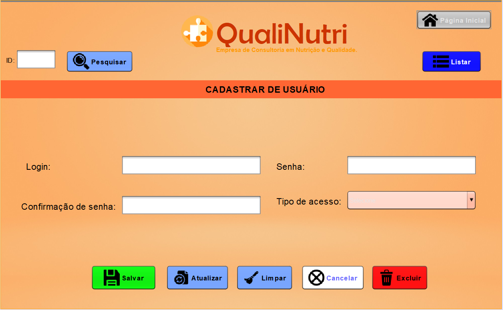
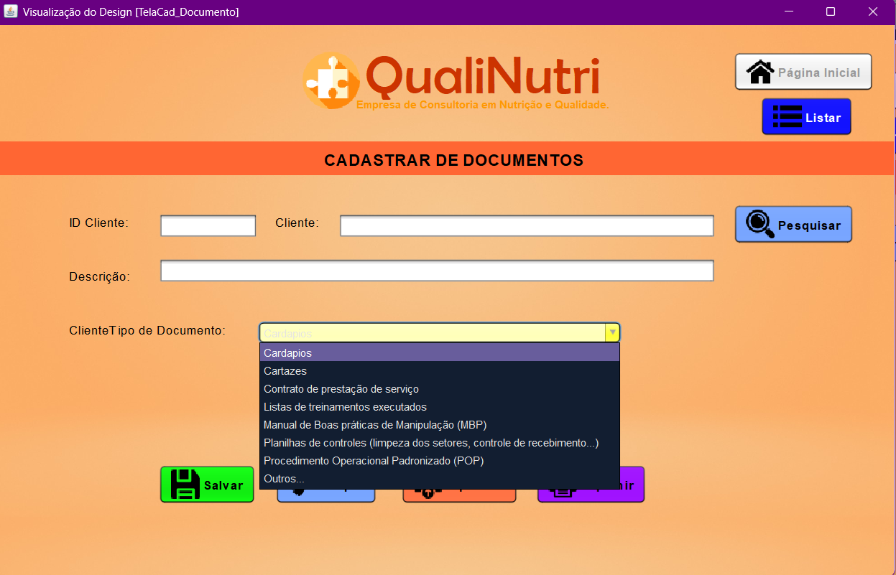
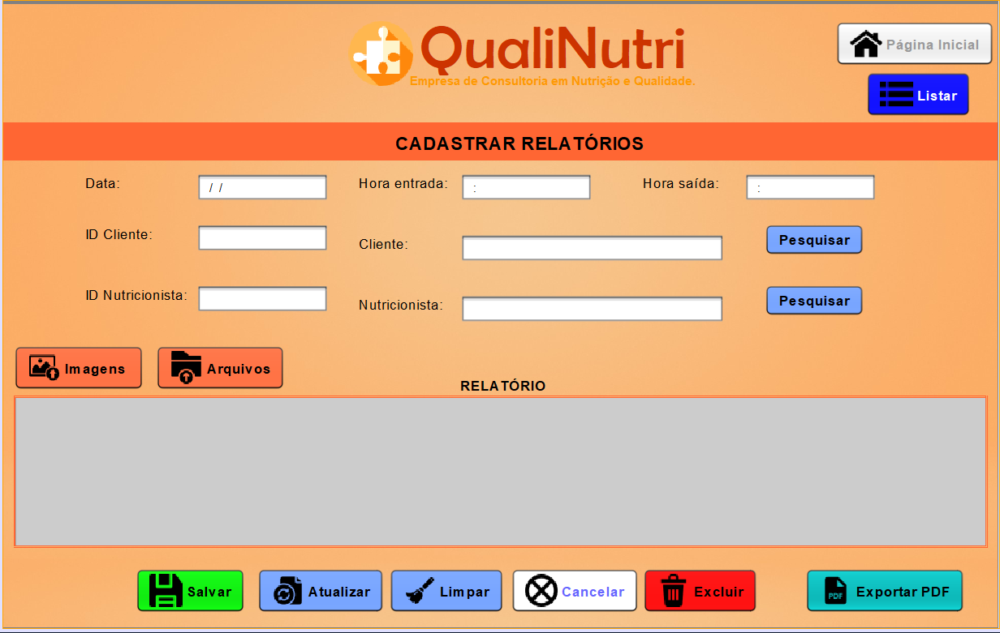

# Sistema_Nutricao_Qualidade


## 📖 Descrição do Projeto

O **Sistema_Nutricao_Qualidade** é um **software desktop** desenvolvido para otimizar o cadastro e gerenciamento de clientes, funcionários, documentos e relatórios de visitas técnicas de uma **Empresa de Consultoria em Nutrição e Qualidade**.


Atualmente, a empresa enfrenta desafios com registros descentralizados em planilhas e documentos físicos. O objetivo do sistema é proporcionar maior **organização, segurança e eficiência** no armazenamento e acesso a esses dados.


## 🎯 Objetivos

- Centralizar o **cadastro de clientes e funcionários**
- Armazenar e gerenciar **relatórios de visitas técnicas**
- Permitir o **upload de documentos** (PDF, Word, Excel, imagens)
- **Anexar fotos** aos relatórios
- Melhorar o **acesso e consulta** às informações


## 🚀 Tecnologias Utilizadas

- **Linguagem de programação:** Java
- **Banco de Dados:** MySQL
- **Interface Gráfica:** Java Swing (NetBeans)
- **Ferramenta de Modelagem:** Figma


## 💡 Funcionalidades

✅ Cadastro de **clientes e funcionários** com informações detalhadas  
✅ Registro e armazenamento de **relatórios de visitas** (digitados ou escaneados)  
✅ Organização automática de relatórios por **data e empresa**  
✅ Upload de **documentos** e anexação de **fotos** nos relatórios  
✅ Controle de acesso com **níveis de permissão** para diferentes usuários  
✅ Impressão dos relatórios em **formato PDF**  


## 👥 Usuários do Sistema

O sistema possui diferentes **níveis de acesso**, garantindo maior controle e segurança:

| **Usuário**                 | **Permissões** |
|-----------------------------|---------------|
| **Gerente Geral**           | Acesso total |
| **Sócio Administrativo**    | Acesso total (exceto cadastro de usuários) |
| **Nutricionista Supervisora** | Cadastro de funcionários, clientes e relatórios |
| **Nutricionista**           | Registro e consulta de relatórios |


## 📷 Imagens do Sistema

Aqui estão algumas telas do sistema desenvolvidas no **NetBeans**:

### 🖥️ **Tela de Cadastro de Usuários**


### 📂 **Tela de Inclusão de Documentos**


### 📝 **Tela de Cadastro de Relatórios**



## 📑 Documentação do Projeto

O projeto foi desenvolvido como parte do **Projeto Integrador (PI) do curso Técnico em Desenvolvimento de Sistemas – SENAC**.

📎 **Acesse a documentação completa:** [Projeto_Integrador.pdf](ProjetoIntegrador_PI - Atividade 1 - Senac.pdf)


## 📌 Como Executar o Projeto

1. Clone este repositório:
```bash
 git clone https://github.com/seu-usuario/Sistema_Nutricao_Qualidade.git
```
2. Abra o projeto no **NetBeans**
3. Configure o **banco de dados MySQL** com o script disponível na pasta `/database`
4. Compile e execute o projeto

## 📢 Contribuição

Se você deseja contribuir, siga estas etapas:

1. Faça um **fork** do repositório  
2. Crie uma **branch** (`git checkout -b minha-branch`)  
3. Faça suas alterações e commit (`git commit -m "Minha contribuição"`)  
4. Envie para o repositório remoto (`git push origin minha-branch`)  
5. Abra um **Pull Request**  

## 📩 Contato

👩‍💻 **Desenvolvedora:** [Juliana Rodrigues](https://github.com/seu-usuario)  
📧 Email: [seu-email@email.com](mailto:seu-email@email.com)  
🔗 **LinkedIn:** [Seu LinkedIn](https://www.linkedin.com/in/seu-usuario)  

